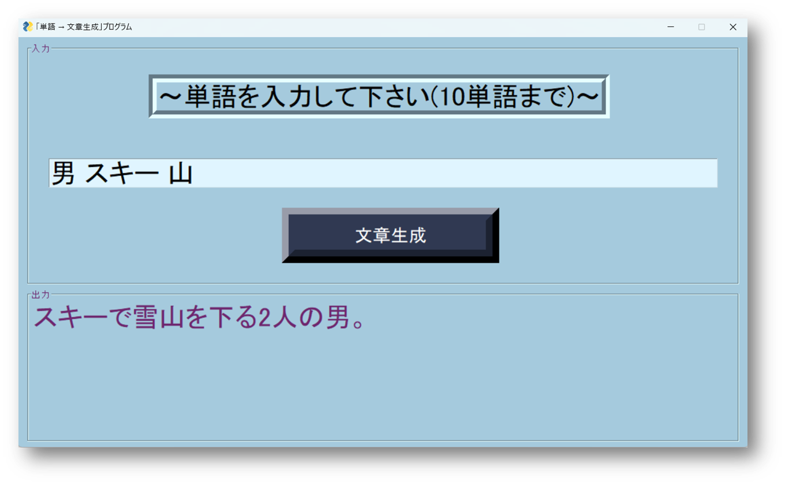
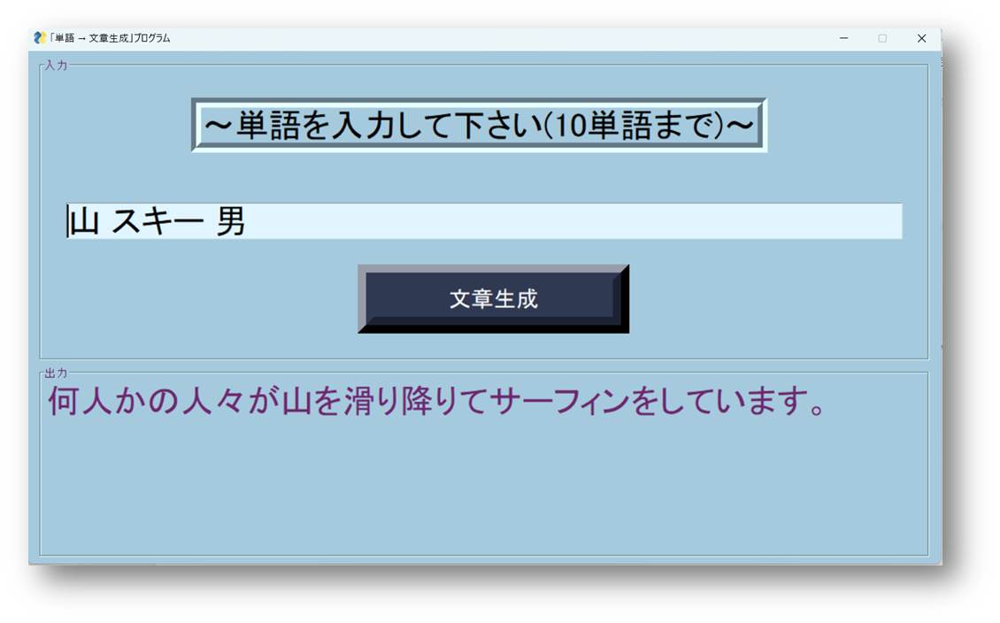
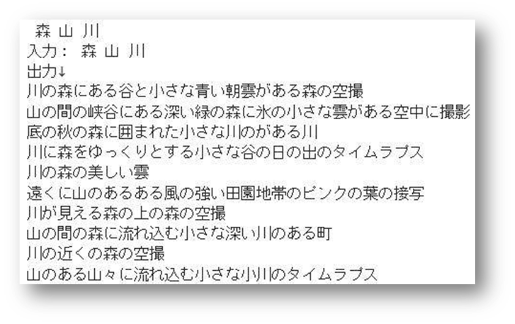
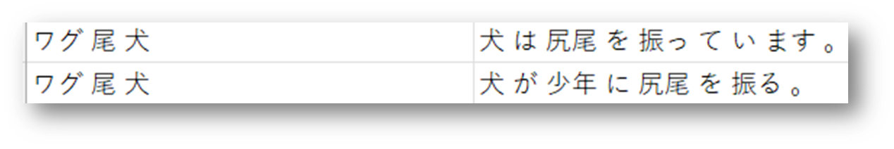

# 単語から文章を生成するAI

## 1. 背景

当時(2023年)chatGPTが出てきて間もないころ、文章生成の面白さを知った。chatGPTの様にtext2textは難しいので単語から文章を生成できないかと考え、このプロジェクトを行った。

## 2. 概要

### 2-1. 使用した技術

seq2seq+Attention

### 2-2. 学習に使用したデータセット

Huggingfaceのcommon_gen(概念から文章)[https://huggingface.co/datasets/allenai/common_gen/viewer/default/train]

### 2-3. 工夫した点

データセットの中身が英語であったため、全て翻訳した

## 3. 結果

### 3-1. 良い点

単語の特徴を捉え、文章の生成に成功している



### 3-2. 悪い点

単語の位置を変更すると、正しい文章が生成されない



単語をすべて含む文は稀にしか生成されない



## 4. 原因

翻訳後のデータセットの質が悪く、うまく学習されなかった



## 5. 解決策

・学習に使用するデータセットを翻訳させずに英語のまま学習させる

・学習時に入力に使う単語をシャッフルする(データ拡張)

## 6. まとめ

学習するさい、データセットに含まれている単語には強く、データセットに含まれてない単語には弱いモデルができた。


# 使用方法

git cloneでレポジトリをクローンする。

```bash
git clone https://github.com/yukihito-jokyu/word2text.git
```

以下のリンクから学習済みモデルをダウンロードしword2text内のディレクトリに保存する。

```
https://drive.google.com/file/d/1K9WPke7t_IcNbbqsNVQ7wwJKZ-5nbhWS/view?usp=sharing
```

word2text.ipynbを上から順に実行する。

# 補足

functionディレクトリ内のコードは以下から引用している

```
https://github.com/oreilly-japan/deep-learning-from-scratch-2
```
